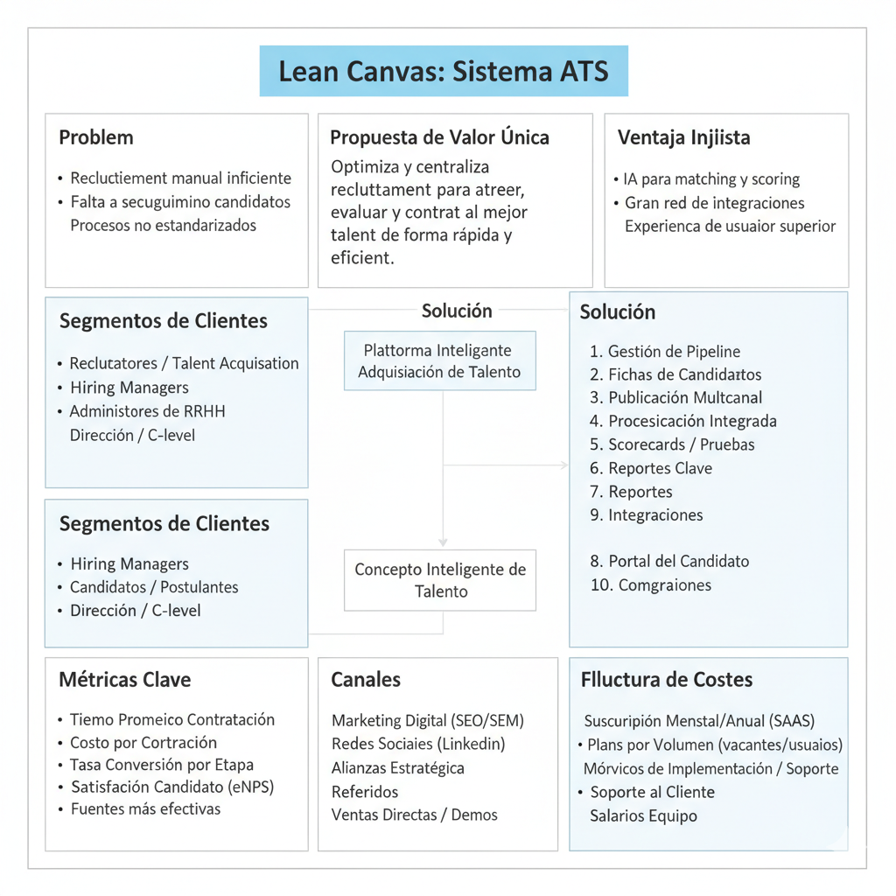
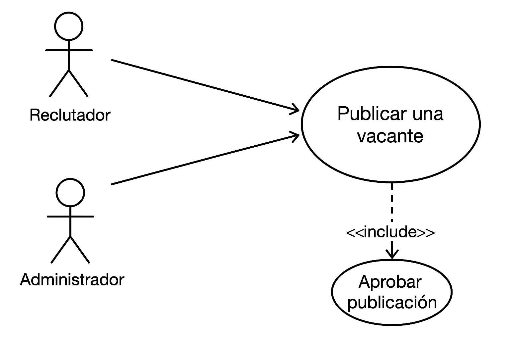
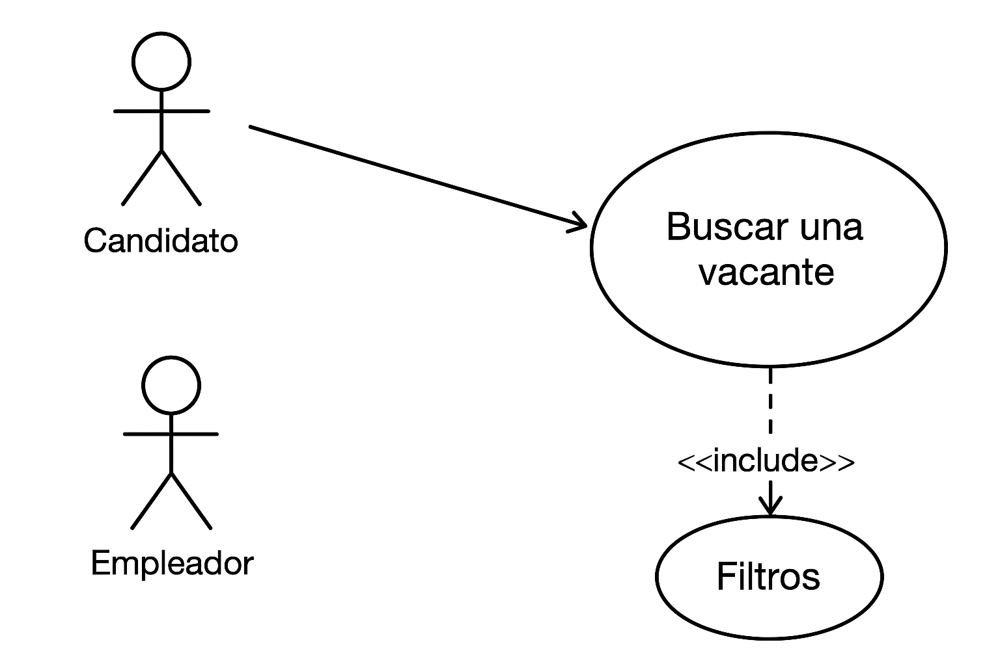
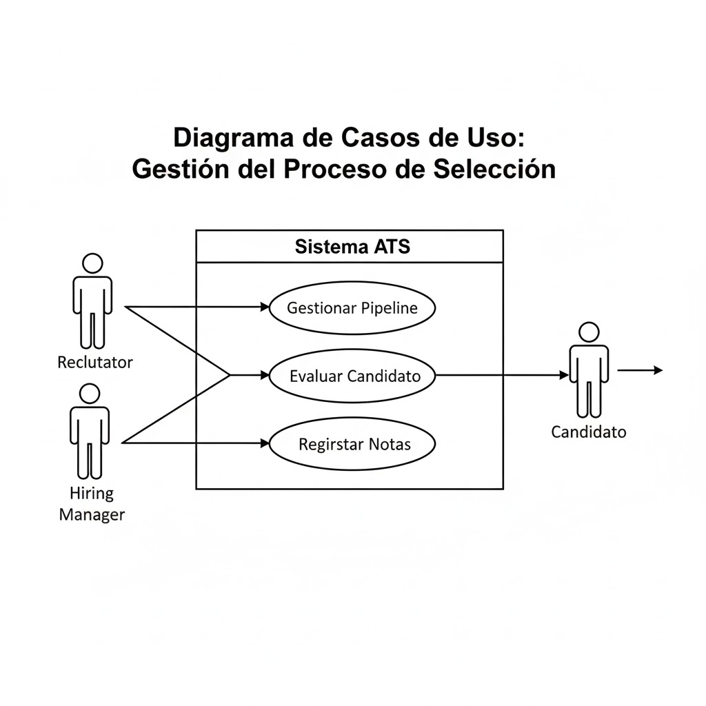
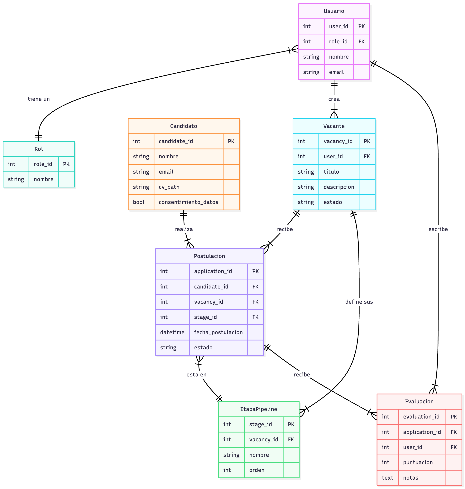
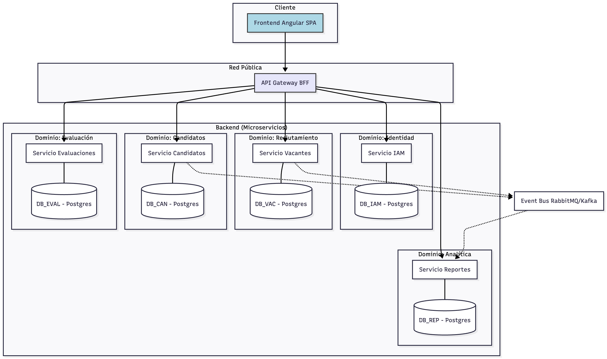
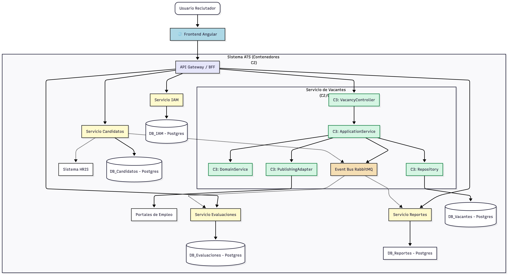

# 🧩 Funcionalidades Básicas y Actores de un Sistema ATS

## 1. Funcionalidades básicas (ordenadas de mayor a menor prioridad)

El orden refleja la prioridad desde el **core del negocio (gestión de candidatos y procesos de selección)** hacia **funciones complementarias o de valor añadido**.

### 🔹 1. Gestión del Proceso de Reclutamiento (Pipeline)
- **Descripción:** Permite definir y gestionar las etapas del proceso (postulación, screening, entrevista, oferta, contratación, etc.).
- **Funciones clave:**
  - Creación de flujos personalizados por tipo de puesto.
  - Movimiento de candidatos entre etapas.
  - Etiquetado o puntuación de candidatos.
  - Automatización de tareas (notificaciones, recordatorios, rechazos automáticos, etc.).

### 🔹 2. Gestión de Candidatos
- **Descripción:** Base central de datos con toda la información de los postulantes.
- **Funciones clave:**
  - Fichas de candidato (datos personales, CV, experiencia, notas de entrevista, comunicación).
  - Búsqueda avanzada y filtros (por habilidades, palabras clave, ubicación, etc.).
  - Histórico de interacciones y seguimiento.

### 🔹 3. Publicación y Gestión de Vacantes
- **Descripción:** Creación, publicación y administración de ofertas laborales.
- **Funciones clave:**
  - Publicación multicanal (bolsas de empleo, LinkedIn, portal interno, página de carrera).
  - Control de estado (abierta, en revisión, cerrada).
  - Aprobaciones internas (workflow de autorización de nuevas vacantes).

### 🔹 4. Gestión de Postulaciones
- **Descripción:** Recibe y organiza las aplicaciones que llegan desde distintos canales.
- **Funciones clave:**
  - Integraciones con portales de empleo y formularios web.
  - Procesamiento automático de CVs (parsing).
  - De-duplicación de candidatos.

### 🔹 5. Comunicación y Colaboración
- **Descripción:** Facilita la interacción entre reclutadores, hiring managers y candidatos.
- **Funciones clave:**
  - Plantillas de correo y mensajería interna.
  - Comentarios y evaluaciones compartidas.
  - Integraciones con calendarios para entrevistas.

### 🔹 6. Evaluación y Calificación de Candidatos
- **Descripción:** Herramientas para valorar objetivamente a los candidatos.
- **Funciones clave:**
  - Formularios de evaluación o scorecards.
  - Pruebas técnicas o psicométricas integradas.
  - Entrevistas estructuradas o feedback 360°.

### 🔹 7. Reportes y Analítica
- **Descripción:** Métricas sobre el proceso de contratación y desempeño del reclutamiento.
- **Funciones clave:**
  - Tiempos promedio de contratación (time to hire).
  - Fuentes de candidatos más efectivas.
  - Tasa de conversión por etapa.

### 🔹 8. Experiencia del Candidato (Candidate Experience)
- **Descripción:** Interfaz y comunicación fluida con el postulante.
- **Funciones clave:**
  - Portal de candidato (para seguimiento de su postulación).
  - Comunicación personalizada y transparente.
  - Formularios amigables y mobile-friendly.

### 🔹 9. Cumplimiento y Seguridad (Compliance)
- **Descripción:** Asegura el cumplimiento de leyes laborales y de protección de datos (GDPR, LFPDPPP, etc.).
- **Funciones clave:**
  - Consentimiento de tratamiento de datos.
  - Auditorías y logs de actividad.
  - Control de permisos y roles.

### 🔹 10. Integraciones con Sistemas Externos
- **Descripción:** Conecta el ATS con otros sistemas corporativos.
- **Ejemplos comunes:**
  - HRIS (Human Resources Information Systems).
  - Plataformas de entrevistas o pruebas técnicas.
  - Herramientas de firma electrónica u oferta laboral.

---

## 2. Actores principales y su rol

| Actor | Rol principal | Relación con funcionalidades |
|-------|----------------|------------------------------|
| **Reclutador / Talent Acquisition Specialist** | Administra vacantes, filtra candidatos, coordina entrevistas y mueve candidatos en el pipeline. | 1, 2, 3, 4, 5, 6, 7 |
| **Hiring Manager (Responsable de Contratación / Líder del Área)** | Colabora en la selección, evalúa candidatos, participa en entrevistas y aprueba la contratación. | 1, 5, 6, 7 |
| **Candidato / Postulante** | Se postula a vacantes, actualiza su información y da seguimiento a su proceso. | 2, 3, 4, 8 |
| **Administrador del Sistema / HRIS Manager** | Configura flujos, permisos, integraciones y asegura el cumplimiento normativo. | 1, 9, 10 |
| **Equipo de Recursos Humanos (Generalista o Analista)** | Da soporte en la publicación de vacantes, comunicación con candidatos y seguimiento general. | 3, 4, 5, 7 |
| **Entrevistadores / Panel de Evaluación** | Evalúan candidatos en base a scorecards o pruebas. | 5, 6 |
| **Dirección o C-level (Ej. CHRO)** | Supervisa métricas y efectividad del reclutamiento a nivel estratégico. | 7, 9 |

---

## 3. Relación general entre actores y flujo funcional

1. **Administrador** configura el sistema (roles, flujos, permisos, integraciones).  
2. **Reclutador** crea la vacante y la publica.  
3. **Candidato** se postula y entra al pipeline.  
4. **Reclutador** revisa, filtra y comunica avances.  
5. **Hiring manager / Entrevistadores** evalúan candidatos.  
6. **Equipo de RH** consolida resultados y gestiona la oferta.  
7. **Dirección** analiza métricas y ajusta estrategias.

---

## 4. Backlog ejemplo para un MVP de ATS

| Prioridad | Funcionalidad | Descripción | Actor principal | Dependencias | Estado |
|------------|----------------|--------------|----------------|---------------|---------|
| 🟢 Alta | Crear y gestionar vacantes | Permite a los reclutadores crear y publicar vacantes en un portal interno | Reclutador | Autenticación básica | Pendiente |
| 🟢 Alta | Registro y postulación de candidatos | Permite a los candidatos aplicar a vacantes mediante un formulario web | Candidato | Vacantes activas | Pendiente |
| 🟢 Alta | Pipeline de reclutamiento | Permite mover candidatos entre etapas del proceso de selección | Reclutador | Gestión de candidatos | Pendiente |
| 🟡 Media | Panel de candidato | Portal donde el candidato puede consultar el estado de su postulación | Candidato | Pipeline, autenticación | Pendiente |
| 🟡 Media | Evaluación básica | Permite registrar notas o comentarios sobre cada candidato | Hiring Manager | Pipeline, gestión de candidatos | Pendiente |
| 🟡 Media | Notificaciones automáticas | Envía correos al avanzar o rechazar un candidato | Reclutador | Pipeline, comunicación | Pendiente |
| 🟠 Baja | Reportes simples | Reporte de vacantes activas y número de postulaciones | Dirección | Pipeline, vacantes | Pendiente |
| 🟠 Baja | Control de roles y permisos | Permite definir permisos de acceso a funcionalidades | Administrador | Autenticación | Pendiente |
| 🔵 Muy baja | Integraciones externas | Conexión con portales de empleo o pruebas técnicas | Administrador | API externas | Futuro |

---

¡Aquí está el Lean Canvas de nuestro ATS!

##  Casos de uso

### 🎯 Caso de uso 1: Publicar una vacante

**Descripción:**

El Reclutador crea una nueva vacante, la configura (título, descripción, requisitos) y la publica en uno o varios canales de reclutamiento.

**Actores principales:**

* **Reclutador** (actor primario)
* **Administrador** (actor secundario, para aprobación o configuración de permisos)

**Flujo principal:**

1.  El Reclutador inicia sesión.
2.  Crea una nueva vacante desde el panel de administración.
3.  Define título, descripción, requisitos y etapas del proceso.
4.  (Opcional) El Administrador aprueba la publicación.
5.  El sistema publica la vacante en el portal de empleos y canales externos.

**Resultado esperado:**

La vacante aparece disponible para que los candidatos se postulen.

Diagrama

---

### 🧾 Caso de uso 2: Postulación del candidato

**Descripción:**

El Candidato visualiza una vacante publicada, completa el formulario de postulación y envía su solicitud.

**Actores principales:**

* **Candidato** (actor primario)
* **Sistema ATS** (actor secundario, receptor del registro)

**Flujo principal:**

1.  El Candidato ingresa al portal de empleos.
2.  Consulta las vacantes activas.
3.  Selecciona una vacante y presiona “Postularme”.
4.  Completa el formulario y adjunta su CV.
5.  El sistema confirma la recepción y registra la postulación.

**Resultado esperado:**

El candidato queda registrado en la base del ATS y asociado al proceso de selección correspondiente.

Diagrama

---

### 🔄 Caso de uso 3: Gestión del proceso de selección

**Descripción:**

El Reclutador y el Hiring Manager gestionan a los candidatos en el pipeline del proceso, moviéndolos entre etapas, evaluándolos y comunicándose con ellos.

**Actores principales:**

* **Reclutador** (actor primario)
* **Hiring Manager** (actor secundario)
* **Candidato** (actor pasivo)

**Flujo principal:**

1.  El Reclutador visualiza el pipeline de la vacante.
2.  Filtra y revisa candidatos postulados.
3.  Coordina entrevistas con el Hiring Manager.
4.  Registra evaluaciones y notas.
5.  Mueve al candidato a la siguiente etapa o marca como rechazado.
6.  El sistema notifica al candidato según corresponda.

**Resultado esperado:**

El candidato avanza en el proceso o se cierra su postulación con trazabilidad completa.

Diagrama

Diagrama entidad relación

# 🚀 Propuesta de Arquitectura: Sistema ATS

A continuación, se describe una arquitectura de alto nivel para el sistema ATS, diseñada para ser escalable, segura y mantenible, utilizando las funcionalidades y actores del documento de contexto.

La arquitectura se basa en una separación clara de responsabilidades, alineada con los principios de **Domain-Driven Design (DDD)**.

## 1. Filosofía de Diseño

El sistema se divide en **Dominios de Negocio (Bounded Contexts)**, donde cada dominio es propietario de una parte específica de la lógica y los datos. Esta separación nos permite implementar una **arquitectura de microservicios**, donde cada servicio es una manifestación de un Bounded Context.

* **Frontend (Angular):** Actúa como el consumidor principal de la API. Es una Single-Page Application (SPA) que proporciona la interfaz de usuario para todos los actores.
* **Backend (Microservicios):** Lógica de negocio desacoplada.
* **Base de Datos (PostgreSQL):** Persistencia de datos, con un enfoque de "base de datos por servicio".
* **Seguridad (RBAC con JWT):** Un servicio dedicado gestiona la identidad y los permisos.

---

## 2. Arquitectura Backend: Microservicios y DDD

Basándonos en las funcionalidades descritas, identificamos los siguientes Dominios (Bounded Contexts) que se traducirán en nuestros microservicios principales:

### 🔹 Dominio 1: Gestión de Identidad y Acceso (Servicio IAM)

Este servicio es fundamental y transversal. Maneja la identidad de todos los actores y sus permisos.

* **Responsabilidad:** Autenticación (login), registro y gestión de usuarios y roles.
* **Funcionalidades del MD:** "Cumplimiento y Seguridad", "Control de permisos y roles".
* **Actores:** Todos los actores inician sesión aquí (`Reclutador`, `Hiring Manager`, `Candidato`, `Administrador`, etc.).
* **Patrón DDD:** Actúa como un *Contexto Genérico* o *Compartido*. Gestiona los Agregados `User` y `Role`.

### 🔹 Dominio 2: Núcleo de Reclutamiento (Servicio de Vacantes)

Este es el *Core Domain*. Gestiona el ciclo de vida de una oferta de trabajo.

* **Responsabilidad:** Definir, publicar y administrar ofertas laborales.
* **Funcionalidades del MD:** "Gestión del Proceso de Reclutamiento (Pipeline)", "Publicación y Gestión de Vacantes".
* **Actores:** Principalmente `Reclutador` (crea) y `Administrador` (aprueba).
* **Patrón DDD:** Gestiona los Agregados `Vacancy` (Vacante) y `PipelineTemplate` (Plantilla de Flujo).

### 🔹 Dominio 3: Gestión de Candidatos (Servicio de Candidatos)

Este servicio se centra en la información y las interacciones del postulante.

* **Responsabilidad:** Almacenar perfiles de candidatos, gestionar postulaciones y la experiencia del candidato.
* **Funcionalidades del MD:** "Gestión de Candidatos" (fichas, CVs), "Gestión de Postulaciones" (parsing, de-duplicación), "Experiencia del Candidato" (portal de candidato).
* **Actores:** `Candidato` (dueño de sus datos), `Reclutador` (gestiona datos).
* **Patrón DDD:** Gestiona los Agregados `Candidate` y `Application` (Postulación).

### 🔹 Dominio 4: Evaluación y Colaboración (Servicio de Evaluaciones)

Este servicio maneja la interacción social y valorativa del proceso.

* **Responsabilidad:** Registrar feedback, coordinar entrevistas y gestionar la comunicación.
* **Funcionalidades del MD:** "Comunicación y Colaboración" (plantillas, mensajería), "Evaluación y Calificación de Candidatos" (scorecards, pruebas).
* **Actores:** `Reclutador`, `Hiring Manager`, `Entrevistadores`.
* **Patrón DDD:** Gestiona Agregados como `Scorecard`, `Interview` y `Comment`.

### 🔹 Dominio 5: Analítica e Integraciones (Servicio de Reportes)

Un servicio de soporte enfocado en la inteligencia de negocio y conexiones externas.

* **Responsabilidad:** Generar métricas y conectar con sistemas de terceros.
* **Funcionalidades del MD:** "Reportes y Analítica" (time to hire, etc.), "Integraciones con Sistemas Externos" (HRIS, APIs).
* **Actores:** `Dirección` (consume reportes), `Administrador` (configura integraciones).
* **Patrón DDD:** Utiliza un patrón **CQRS** (Separación de Comandos y Consultas), consumiendo eventos de otros servicios (vía un *Event Bus*) para construir sus propias tablas optimizadas para lectura y reporteo.

---

## 3. Base de Datos: PostgreSQL

Para mantener el desacoplamiento de los microservicios, se seguirá el patrón **"Base de Datos por Servicio"**.

* Cada microservicio (IAM, Vacantes, Candidatos, etc.) tendrá su **propia base de datos PostgreSQL** (o, como alternativa pragmática, su **propio esquema** dentro de un mismo servidor Postgres).
* **Integridad de Datos:** Un servicio *nunca* debe consultar directamente la base de datos de otro. La comunicación se realiza exclusivamente vía API (sincrónica) o a través de un Bus de Eventos (asincrónica).
* **Ejemplo:** Cuando un `Candidato` postula, el *Servicio de Candidatos* publica un evento `CandidatoPostulo`. El *Servicio de Vacantes* escucha ese evento y actualiza su contador de postulantes para esa vacante.

---

## 4. Arquitectura Frontend: Angular

El frontend será una **Single-Page Application (SPA)** robusta construida con Angular.

* **Estructura Modular:** Se crearán módulos en Angular que reflejen los dominios del backend (ej. `AuthModule`, `RecruitmentModule`, `CandidatesModule`).
* **Consumo de API:** El cliente Angular no conocerá los microservicios individuales. Se comunicará con un **API Gateway**, que actúa como fachada única (BFF - Backend for Frontend).
* **Gestión de Estado:** Se utilizará un gestor de estado (como **NgRx** o **servicios de Angular** con Subjects) para manejar la información del usuario autenticado y los datos de la aplicación (vacantes, candidatos, etc.).

---

## 5. Seguridad: Autenticación y Autorización (RBAC)

Este es un pilar crítico, gestionado por el **Servicio IAM**.

### 🔐 Autenticación (AuthN)

1.  El `Candidato`, `Reclutador` o cualquier actor envía sus credenciales (email/password) al *Servicio IAM*.
2.  El servicio valida las credenciales contra su base de datos (Postgres).
3.  Si es exitoso, genera un **JSON Web Token (JWT)**. Este token contiene el `user_id` y su `role` (ej. "Reclutador").
4.  El cliente Angular almacena este JWT de forma segura (ej. `localStorage` o `sessionStorage`) y lo envía en el *header* `Authorization` de cada solicitud futura.

### 🛡️ Autorización (AuthZ) - Basada en Roles (RBAC)

La autorización se aplica en dos niveles:

1.  **En el API Gateway (Perímetro):**
    * El Gateway intercepta *todas* las solicitudes.
    * Valida la firma del JWT (usando la clave pública del Servicio IAM). Si es inválido, rechaza la solicitud (Error 401).
    * Puede realizar una primera capa de autorización (ej. el *endpoint* `/admin/*` solo es accesible para el rol "Administrador").

2.  **En cada Microservicio (Lógica de Negocio):**
    * El Gateway reenvía la solicitud al microservicio correspondiente, pasando la información del usuario (extraída del JWT).
    * El microservicio aplica la lógica de negocio fina basada en el rol.
    * **Ejemplos basados en el MD:**
        * Un `Hiring Manager` puede *ver* candidatos y *evaluarlos*, pero no puede *crear* una nueva vacante (eso lo hace el `Reclutador`).
        * Un `Candidato` solo puede ver *su propia* postulación ("Portal de candidato") y no las de otros.
        * Un `Administrador` puede configurar "Integraciones" y "permisos", acciones que otros roles no pueden.

---

## 6. Diagrama Conceptual de la Arquitectura

## 6. Diagrama C4

